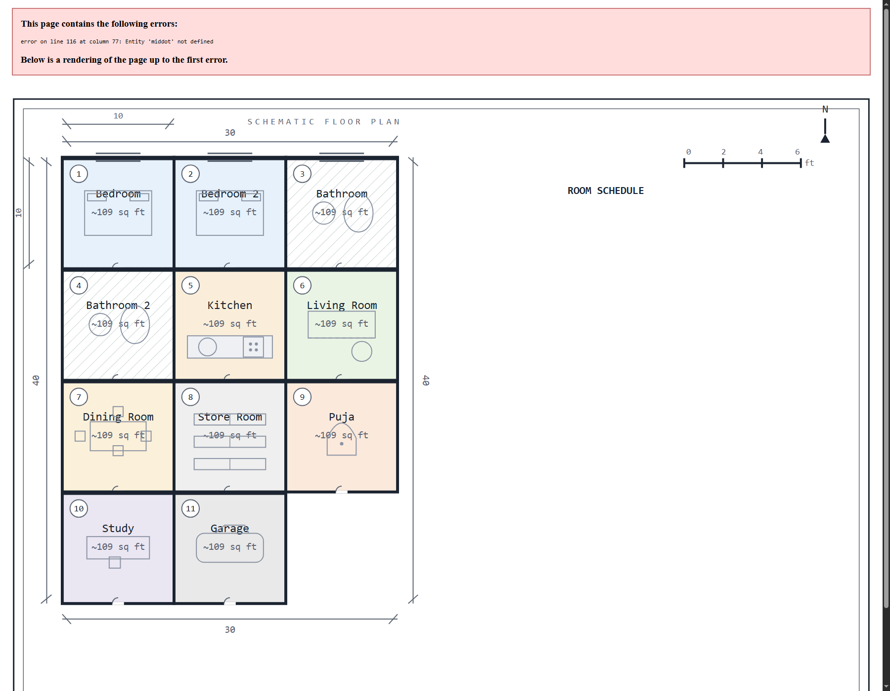
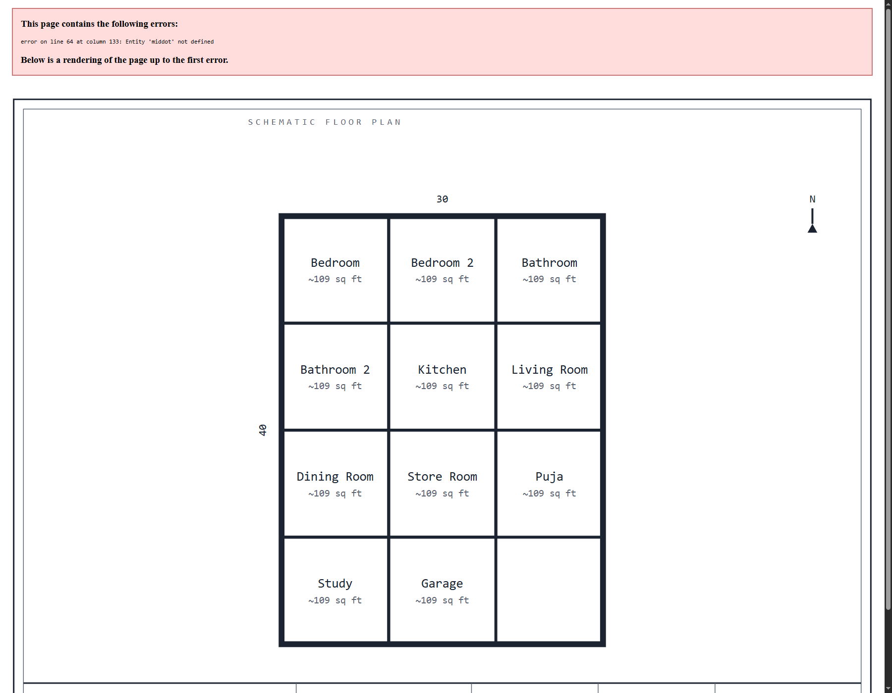

# Arch-Svg

Zero-dependency architectural floor-plan generator. Describe a building, and Arch-Svg produces a professional SVG drawing sheet: floor plan with walls, doors, windows, furniture, dimensioning, room schedule, legend, scale bar, and title block.

## Preview

**Advanced plan** (rooms, furniture, door swings, dims, schedule, legend, title block):



**Basic plan** (room grid with names and areas):



## Features

- Generate plans with a single POST request - no build step, no npm dependencies
- Two rendering engines:
  - **NVIDIA LLM** - draws a bespoke plan via the [NVIDIA NIM API](https://integrate.api.nvidia.com) (streaming, up to 3 attempts)
  - **Deterministic local fallback** - exact grid-based plan, always works offline
- **Geometric auto-repair** - after every LLM pass the output is parsed and corrected:
  - furniture that crosses a wall is translated back into its room
  - oversized pieces are scaled to fit
  - duplicate elements are dropped
- **QA analyzer** - validates room count, door swing arcs, furniture/wall clearance, duplicates, schedule presence; a repair prompt is sent back to the LLM (up to 2 rounds) when something fails
- Professional sheet presentation: drawing frame, north arrow, scale bar, ROOM SCHEDULE with totals, LEGEND, and a title block (project / floor / scale / sheet / date)
- Metric or imperial input, 1-6 floors, 9 room types, basic/advanced detail level

## Getting started

Requires Node.js 18+.

```bash
git clone https://github.com/sudish80/Arch-Svg.git
cd Arch-Svg
node server.js
```

Open http://localhost:3000, fill in the project details, and click **Generate**.

### NVIDIA API key (optional)

The local fallback works without any key. To enable LLM-drawn plans, set your key in one of two ways:

```bash
# environment variable
$env:NVIDIA_API_KEY = "nvapi-..."
```

```js
// or config.local.js (already gitignored)
module.exports = { DEFAULT_API_KEY: "nvapi-..." };
```

The optional model can be set with `NVIDIA_MODEL` (default `openai/gpt-oss-120b`).

## API

`POST /api/generate`

```json
{
  "specs": {
    "projectTitle": "Sunrise Villa",
    "plotWidth": 30,
    "plotLength": 40,
    "unit": "ft",
    "detail": "advanced",
    "floor": {
      "label": "Ground Floor",
      "notes": "",
      "rooms": { "bedroom": 2, "bathroom": 2, "kitchen": 1, "living": 1, "dining": 1, "store": 1, "puja": 1, "study": 1, "garage": 1 }
    },
    "floorIndex": 0,
    "numFloors": 2
  },
  "local": false,
  "useFallback": true,
  "autoFix": true
}
```

Response:

```json
{
  "ok": true,
  "svg": "<svg ...>",
  "local": false,
  "repaired": true,
  "issues": ["..."]
}
```

- `local: true` skips the LLM and uses the deterministic renderer.
- `useFallback: true` falls back to it if the LLM is unavailable.
- `autoFix: true` enables geometric repair + QA rounds (default).

## How it works

1. `buildPromptNvidia` composes a strict drafting specification (plot scale, room list, presentation rules).
2. `callNvidia` streams a response; `extractSvg` pulls out the raw SVG.
3. `repairGeometry` parses every element, derives the room grid from the wall lines, and applies exact `translate`/`scale` transforms to clamp furniture inside its room and remove duplicates.
4. `analyzeSvg` runs the QA checks (it is transform-aware, so it evaluates the final rendered geometry).
5. If issues remain, `buildRepairPrompt` sends the full QA report back to the LLM for another attempt (max 2 rounds).
6. `localFallback` renders an exact grid plan with the same professional sheet when no LLM output is available.

## Project structure

```
server.js             Node server: prompts, LLM client, QA, geometry repair, fallback renderers
public/index.html     UI shell
public/app.jsx        React UI (no build step - inline transform)
config.js             Model/key config (reads env, falls back to gitignored config.local.js)
images/               README preview renders
```

## Security

The repo ships with no API keys. Keys live in environment variables or in `config.local.js`, which is gitignored. Logs, test scripts, and local config are excluded from version control.
